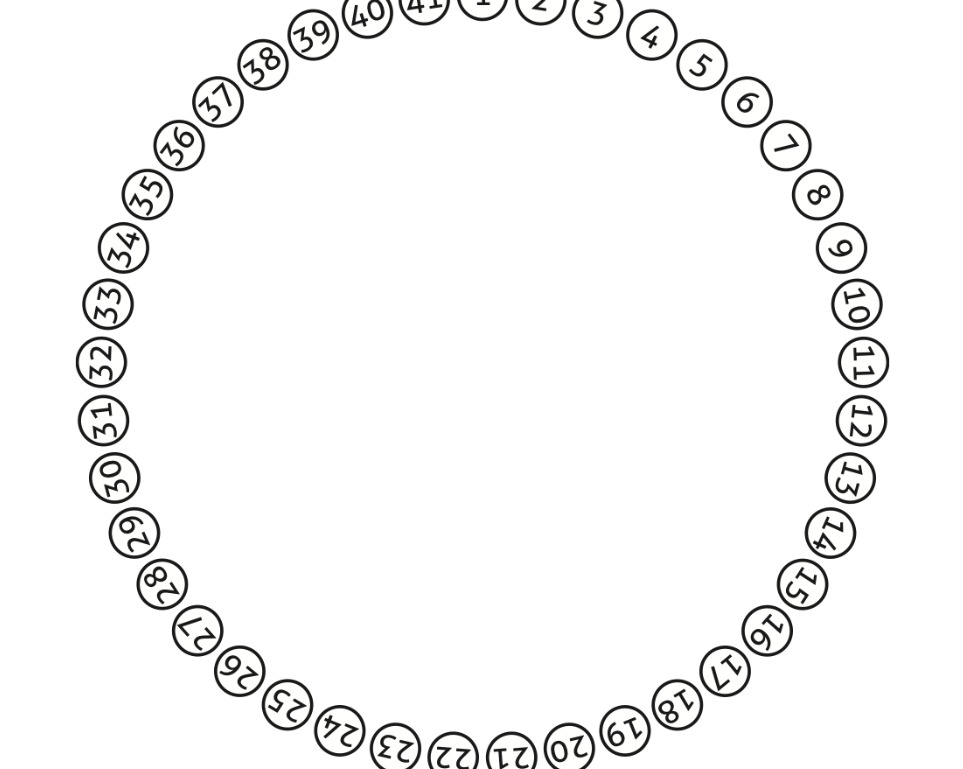

# PROBLEMA DE JOSEPHUS

Están las cuarenta y un posiciones numeradas en forma creciente. Supongamos que empieza el que está sentado en la posición número 1. Ese soldado matará al 2. Luego, el 3 matará al 4, el 5 al 6... y así siguiendo. Como usted advierte, llegará un momento en el que habrán muerto todos los que están sentados en las posiciones que llevan un número par. Pero cuando muera el último de ellos, el número 40 (a manos del 39), el 41 estará vivo aún y ahora, el que tiene sentado a la izquierda es el número 1 quien había empezado con los asesinatos.

De acuerdo con las reglas, el 41 matará al 1, el 3 matará al 5, etc. Creo que ahora está claro que van a morir todos hasta que quede solamente uno con vida.

Es aquí donde aparece una parte interesante de la historia de Josephus. En principio, habrían de morir todos los soldados que estaban con Josephus en la caverna, pero la diferencia es que quien quedara último tendría que suicidarse... Más aún: el sobreviviente tendría que quitarse la vida y no habría ningún otro integrante del grupo que estuviera vivo para verificar que lo hiciera.

<table>
  <tr>
    <th>No. de participantes</th>
    <th>Posición que vive</th>
  </tr>

  <tr>
    <td>1</td>
    <td>1</td>
  </tr>

  <tr>
    <td>2</td>
    <td>1</td>
  </tr>

  <tr>
    <td>3</td>
    <td>3</td>
  </tr>

  <tr>
    <td>4</td>
    <td>1</td>
  </tr>

  <tr>
    <td>5</td>
    <td>3</td>
  </tr>

  <tr>
    <td>6</td>
    <td>5</td>
  </tr>

  <tr>
    <td>7</td>
    <td>7</td>
  </tr>

  <tr>
    <td>8</td>
    <td>1</td>
  </tr>

  <tr>
    <td>9</td>
    <td>3</td>
  </tr>

  <tr>
    <td>10</td>
    <td>5</td>
  </tr>

  <tr>
    <td>11</td>
    <td>7</td>
  </tr>

  <tr>
    <td>12</td>
    <td>9</td>
  </tr>

  <tr>
    <td>13</td>
    <td>11</td>
  </tr>

  <tr>
    <td>14</td>
    <td>13</td>
  </tr>

  <tr>
    <td>15</td>
    <td>11</td>
  </tr>

  <tr>
    <td>16</td>
    <td>1</td>
  </tr>

  <tr>
    <td>20</td>
    <td>9</td>
  </tr>

  <tr>
    <td>21</td>
    <td>11</td>
  </tr>

  <tr>
    <td>40</td>
    <td>17</td>
  </tr>

  <tr>
    <td>41</td>
    <td>19</td>
  </tr>
 
</table>