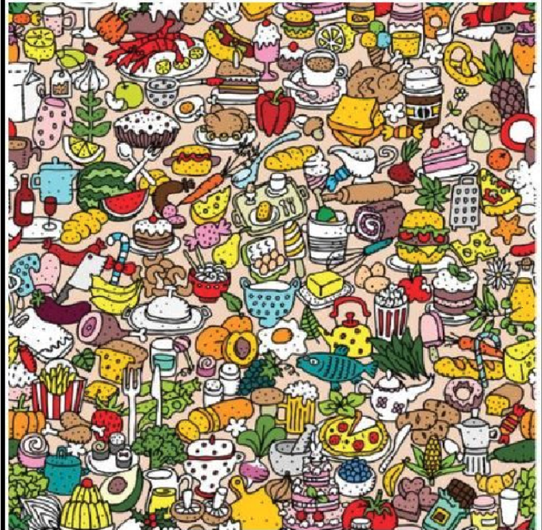
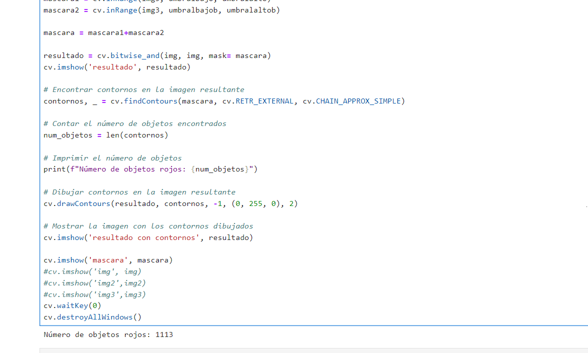
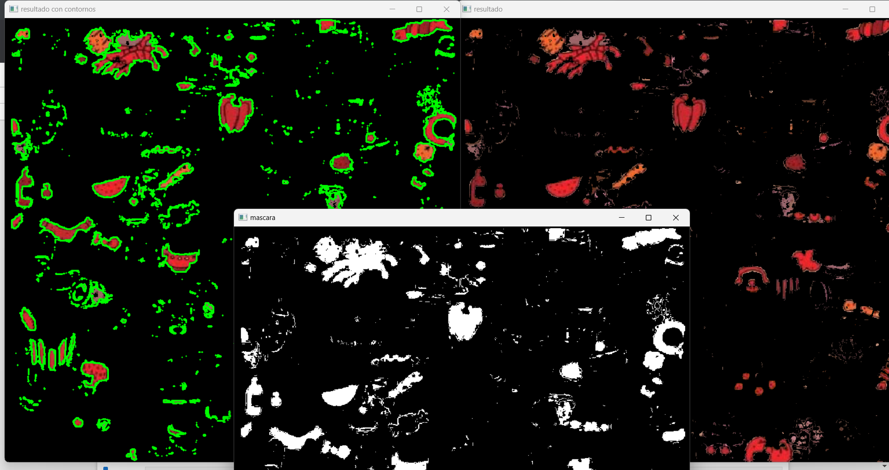

# Objetos Rojos

import cv2 as cv
import numpy as np

img = cv.imread("C:\\Users\\cryst\\OneDrive\\Escritorio\\TAREAS-IA\\objetosrojos.png",1)
img2 = cv.cvtColor(img, cv.COLOR_BGR2RGB)
img3 = cv.cvtColor(img2, cv.COLOR_RGB2HSV)

umbralbajo=(0,80,80)
umbralalto=(10,255,255)
umbralbajob=(170,80,80)
umbralaltob=(180,255,255)

mascara1 = cv.inRange(img3, umbralbajo, umbralalto)
mascara2 = cv.inRange(img3, umbralbajob, umbralaltob)

mascara = mascara1+mascara2

resultado = cv.bitwise_and(img, img, mask= mascara)
cv.imshow('resultado', resultado)

contornos, _ = cv.findContours(mascara, cv.RETR_EXTERNAL, cv.CHAIN_APPROX_SIMPLE)

num_objetos = len(contornos)

print(f"Número de objetos rojos: {num_objetos}")

cv.drawContours(resultado, contornos, -1, (0, 255, 0), 2)

cv.imshow('resultado con contornos', resultado)

cv.imshow('mascara', mascara)
#cv.imshow('img', img)
#cv.imshow('img2',img2)
#cv.imshow('img3',img3)
cv.waitKey(0)
cv.destroyAllWindows()

